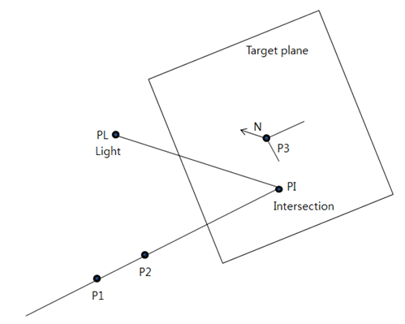
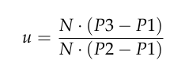
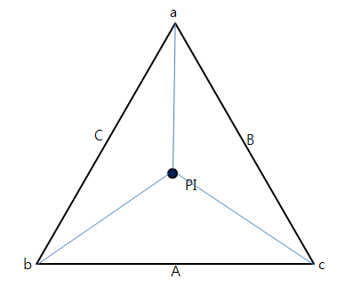
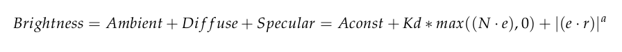
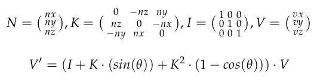
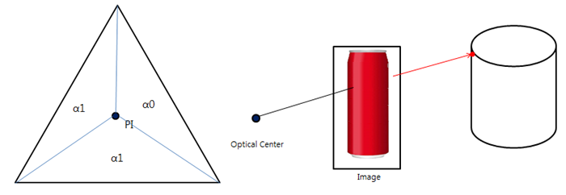
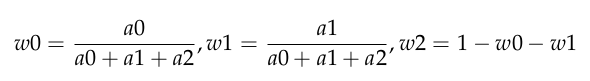
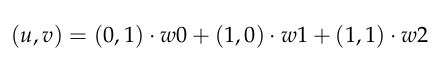

# 00. Rendering
 - My research requires a logic that can partially calculate depth, color, and brightness for certain lights in pixels. However, the function was not found in commercial or other open-source rendering engines, so it was implemented separately. It was implemented in C/C++ and optimized with OpenMP. I wrapped it in .dll and .so to call the code in Python.

# 01. Depth Map Generation
- A depth map is a two-dimensional array structure representing the distance from the optical center to the subject. Find the distance to the target facet. P1 is an optical center and has a direction vector to P2. N is the normal vector of the facet.

 - Ray Tracing/P1(Optical Center),P2(Point on Pixel Plane),PI(Intersection on the Target Plane), PL(Light), N(Normal Vector on the Target Plane

 - Then, the distance u can be calculated as shown in the process below, and the intersection point with the plane can also be determined.

- Determining if there is a Point in the facet

If all three case's signs are the same, P is in the triangle.
    Case 1: cross-product of vector A-C and vector A-bPI.
    Case 2: cross-product of vector B-C and B-aPI.
    Case 3: cross-product of vector A-B and vector A-cPI.

In the case of square polygons, perform this one more time. Among these, the shortest u is the polygon seen in the optical center.

# 02. Brightness Calculation
The light follows the pong light. There are three cases.

- (1) In Figure A1, if an object exists between the PI and PL, the PI is in the shadow area.\newline
- (2) When the light is directly viewed, when the object of PI is illumination, the amount of light (0 to 1.0) of the object is used as it is.\newline
- (3) In the amount of light (0-1.0) of the object where the reflected PL collides with the light

- e = P2-P1 : Vector of the line of sight to the optical center 
- l = PI-PL : Vector to illumination 
- r = 2(N·l)N-l

# 03. Scene Generation
The scene converts the Rodriguez rotation into a stack structure from a global coordinate system to a local coordinate system of the object.

The above equations show the rotation of V by $\theta$ about axis vector N.

# 04. Mesh Generation from Depth Map

A depth map is a group of points, but it provides the ability to weave them together to create a mesh. Since it is an arbitrary depth map, it comprises triangular polygons with intervals determined by the user. The first triangle is in the form of [(0,0) (0,Iy), (Ix,IY)], the second triangle is in the form of [(0,0) (Ix,0), (Ix,IY)], and the adjacent triangles share two vertexes.

# 05. Texture Overlay

The figure below shows what you can do when you want to draw a cylinder, take a picture of a red can, and put a texture on the cylinder. When a ray extending to the Optical center takes color from the pixel plane and collides with the polygon of the cylinder, the texture area becomes the image's color.

The collision point PI is initially changed to barycentric coordination.

After that, these are then converted into texture coordinates.

The overlayed textures require interpolating to fill empty pixels.

